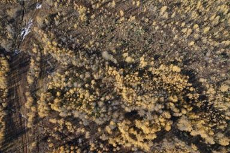
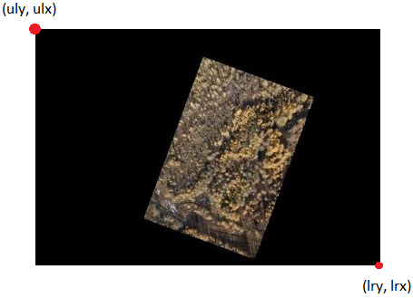
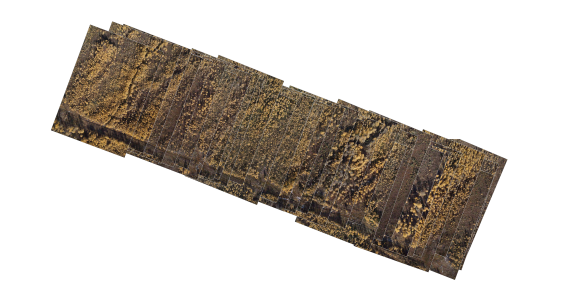
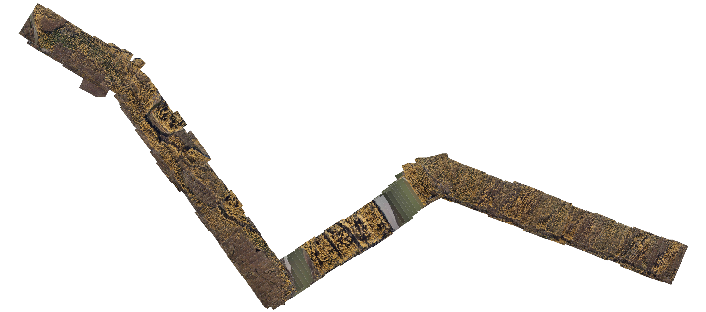
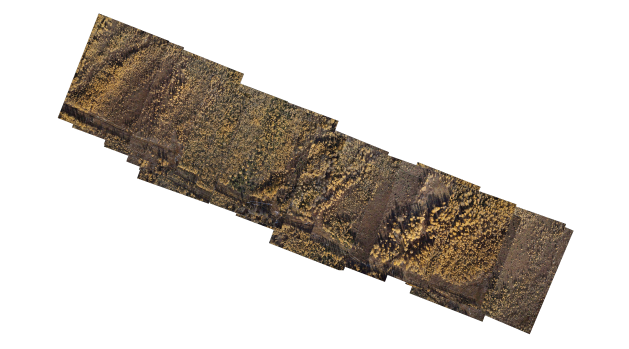
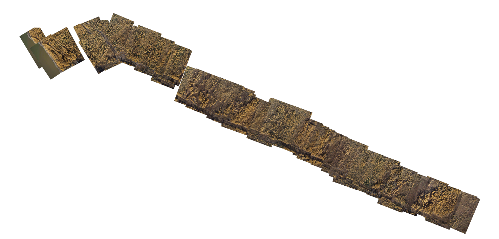

# Orthophoto map based on drone images

# Pipeline

`polygons.py` is used to adjust images taking into account the orientation of the drone at the time of shooting, and calculates the coordinates of the image boundaries.

Example of an input image with telemetry data:

Telemetry data

| lat     | lon      | roll  | pitch | yaw    | alt      |
| ------- | -------- | ----- | ----- | ------ | -------- |
| 62.5462 | 150.8463 | -1.12 | 7.93  | -69.82 | 542.0640 |

Image

Processing result:

Border coordinates

| ulx      | uly     | lrx      | lry     |
| -------- | ------- | -------- | ------- |
| 150.8406 | 62.5480 | 150.8519 | 62.5444 |

Converted image

## 

`stitch.py` performs stitching of multiple images based on boundary coordinate data.

Orthomosaic examples

30 images

197 images

# 

`stitch_cv.py` builds a mosaic of images using computer vision algorithms to find correspondences between key points in the images.

Orthomosaic examples

30 images

75 images

# Sources

1. https://github.com/davidraleigh/dronedeploy
2. https://github.com/adityajain07/Drone-Images-Mosaicing
